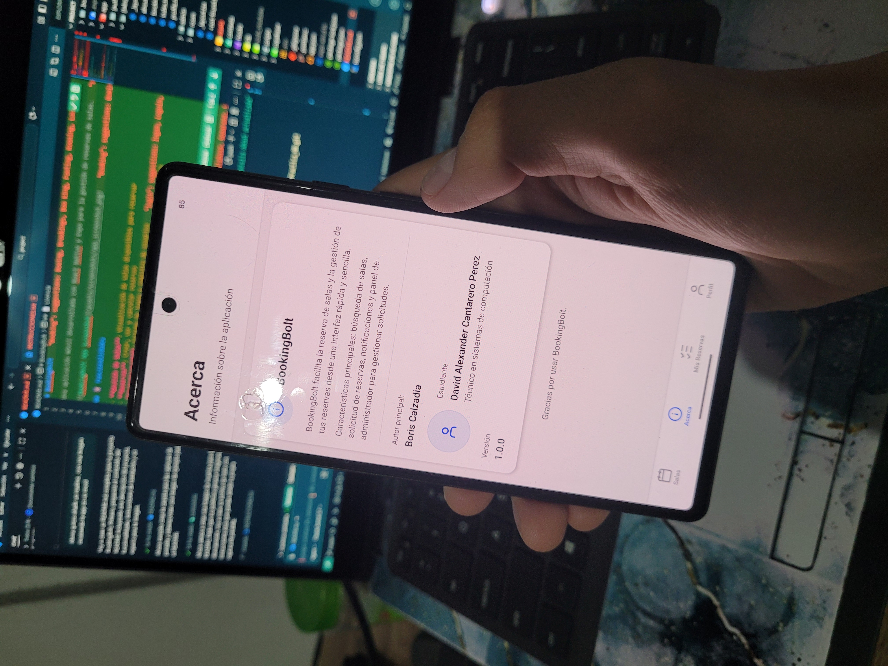

# BookingBolt

Una aplicación móvil desarrollada con React Native y Expo para la gestión de reservas de salas.



## 📱 Funcionalidades

- **Gestión de Salas**: Visualización de salas disponibles para reservar
- **Reservas**: Crear, ver y cancelar reservas
- **Autenticación**: Sistema de login y registro de usuarios
- **Panel de Administrador**: Gestión avanzada de reservas para administradores
- **Perfil de Usuario**: Visualización y gestión de información personal

## 🛠️ Tecnologías

- React Native
- Expo Router
- Supabase (Autenticación y Base de Datos)
- TypeScript
- Lucide Icons

## 🚀 Instalación y Uso

1. Clona este repositorio:
```bash
git clone https://github.com/DavidCantarero99/Practica_RN.git
cd Practica_RN
```

2. Instala las dependencias:
```bash
npm install
```

3. Inicia la aplicación:
```bash
npm run dev
```

4. Abre la app en tu dispositivo:
   - Escanea el código QR con la app Expo Go (Android) o la cámara (iOS)
   - O ejecuta en web con: `w`

## 📸 Capturas de Pantalla

Para ver la aplicación en acción, hemos incluido capturas de pantalla en la carpeta `assets/screenshots/`.

## 👨‍💻 Autor

- **Nombre**: David Cantarero
- **Carrera**: Ingeniería en Sistemas Computacionales

## 📄 Licencia

Este proyecto está bajo la Licencia MIT - ver el archivo [LICENSE](LICENSE) para más detalles.